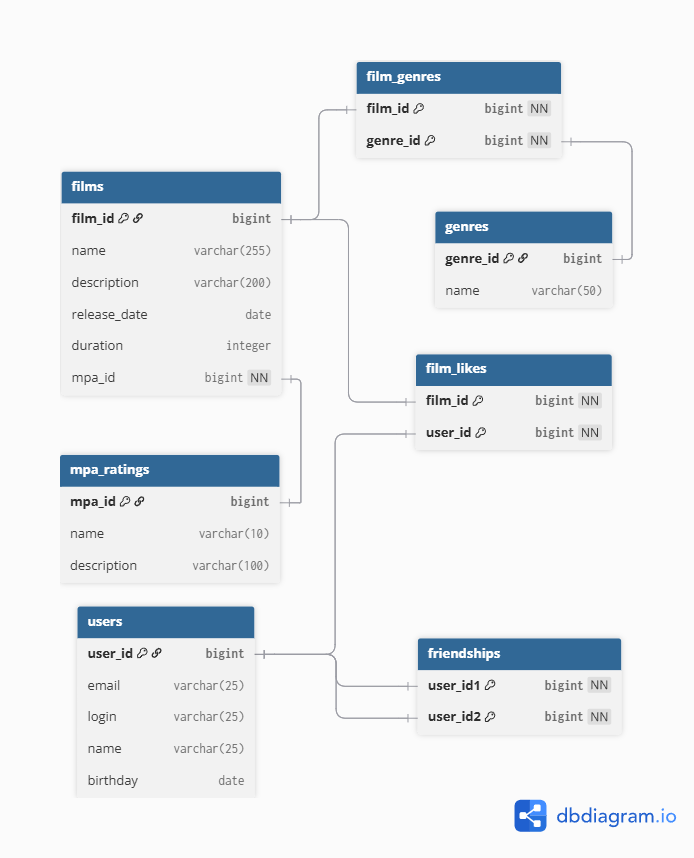

# java-filmorate
Template repository for Filmorate project.
# Filmorate - База данных

## Схема базы данных

*Рисунок 1: Логическая схема базы данных Filmorate*

## Описание схемы

База данных Filmorate состоит из 7 основных таблиц, спроектированных для хранения информации о фильмах, пользователях и их взаимодействиях.

### Основные таблицы:
- **users** - регистрационные данные пользователей
- **films** - информация о фильмах с метаданными  
- **mpa_ratings** - справочник возрастных рейтингов MPA
- **genres** - справочник жанров фильмов

### Таблицы связей:
- **film_genres** - связь многие-ко-многим между фильмами и жанрами
- **film_likes** - учет лайков пользователей фильмам
- **friendships** - система дружбы между пользователями с подтверждением
